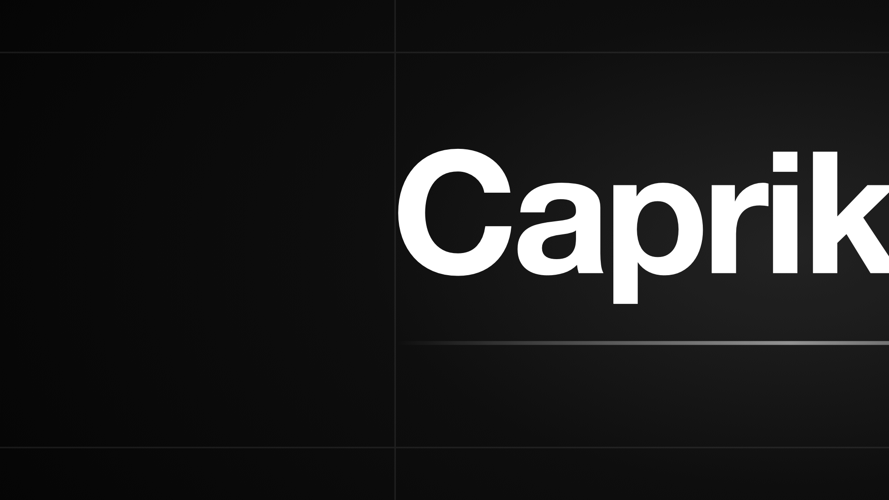

<p align="center">
  
</p>

# Caprika

I build and explain practical AI-agent workflows, local-first tools, and real engineering systems.

## Most Recommended: Open Design

[**Explore Open Design ->**](https://github.com/nexu-io/open-design)

Open Design is an open-source, local-first, agent-native design runtime that turns coding-agent CLIs into a design engine.

Why I recommend it:

- It pairs a local daemon with a web UI, so design work can run against real files and local agent tools.
- It uses portable `DESIGN.md` and `SKILL.md` primitives, making design systems and workflows reusable instead of trapped in one canvas.
- It is artifact-first: the agent produces real design outputs, then routes them through preview, critique, validation, and export.

If you are interested in AI-native product design, Open Design is the project I would start with.

## Other Projects I Work Around

| Project | Why it matters |
|---|---|
| [Refly](https://github.com/refly-ai/refly) | Open-source agent skills builder for turning repeatable AI workflows into reusable skills. |
| [Refly Skills](https://github.com/refly-ai/refly-skills) | Practical skill examples and workflow patterns for agent-powered work. |
| [Nexu](https://github.com/nexu-io/nexu) | Local-first desktop bridge for bringing agents into real communication channels. |

## Current Explorations

- AI coding agents: Codex, Claude Code, Cursor Agent, OpenClaw, and MioClaw.
- Local-first agent tooling: filesystem-backed workflows, desktop runtimes, and personal automation.
- Design and media workflows: prompt systems, artifact generation, and short-form production.
- Engineering notes: deployment, infrastructure, code review, and build-in-public lessons.

## Content Notes

I am using GitHub as public proof of work: code, docs, implementation notes, and project maintenance all matter more than generic AI commentary.

The long-term content direction is simple:

```text
intelligence -> useful content -> audience growth
```

## Contact

- GitHub: [@alchemistklk](https://github.com/alchemistklk)
- X / social: coming soon
- Focus: agent-native tools, local AI workflows, open-source systems, and practical design automation
