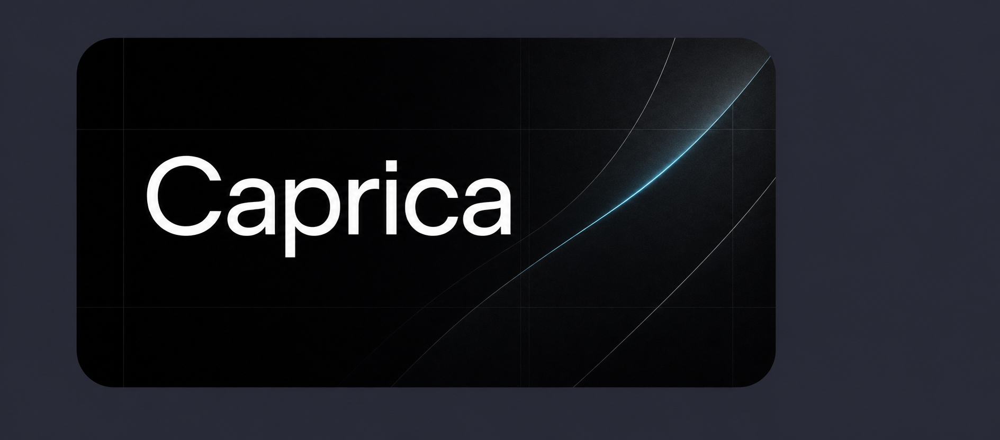

<p align="center">
  
</p>

# Caprika

Agent-native developer building local-first AI tools, design runtimes, and open-source engineering workflows.

```text
agent skills -> local runtime -> filesystem artifacts -> reviewable software
```

## Flagship Project: Open Design

[**Explore Open Design ->**](https://github.com/nexu-io/open-design)

Open Design is the clearest example of the kind of software I care about: open-source, local-first, agent-native systems that turn coding-agent CLIs into real product workflows.

Technical reasons it matters:

- Local daemon + web UI: the agent works against real project files instead of a closed cloud canvas.
- Portable primitives: `DESIGN.md` and `SKILL.md` make design systems and workflows inspectable, versionable, and reusable.
- Artifact-first loop: the agent emits real outputs, then routes them through preview, critique, validation, and export.

If you want to understand my GitHub identity, start here: I am interested in the infrastructure layer where agents, files, tools, and product interfaces meet.

## Supporting Projects

| Project | Why it matters |
|---|---|
| [Refly](https://github.com/refly-ai/refly) | Open-source agent skills builder for turning repeatable AI workflows into reusable skills. |
| [Refly Skills](https://github.com/refly-ai/refly-skills) | Practical skill examples and workflow patterns for agent-powered work. |
| [Nexu](https://github.com/nexu-io/nexu) | Local-first desktop bridge for bringing agents into real communication channels. |

## Technical Focus

- Agent-native application architecture: CLI agents, local daemons, tool adapters, and UI feedback loops.
- Local-first runtimes: filesystem-backed state, desktop sidecars, SQLite persistence, and reproducible workspaces.
- Skill systems: reusable instructions, design systems, prompt protocols, and validation gates.
- Engineering operations: code review, deployment, issue triage, contributor loops, and production debugging.

## GitHub Is My Technical Surface

I use GitHub as public proof of technical work: code, docs, implementation notes, issue handling, review comments, and shipped open-source systems.

Other platforms can carry broader content, demos, and personal storytelling. This profile is intentionally narrower: it is for agent-native development, local AI tooling, and engineering evidence.

## Working Style

- I prefer tools that create inspectable files over tools that hide state behind a hosted interface.
- I care about agent workflows that survive real repositories, review, deployment, and maintenance.
- I treat design, engineering, and operations as one system when agents are part of the workflow.

## Contact

- GitHub: [@alchemistklk](https://github.com/alchemistklk)
- Focus: agent-native development, local AI workflows, open-source systems, and technical design automation
